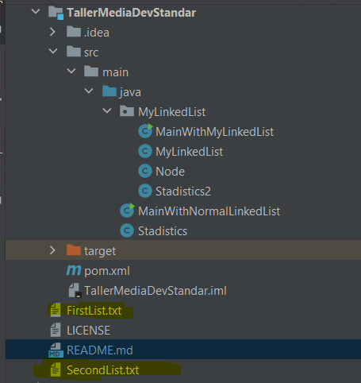
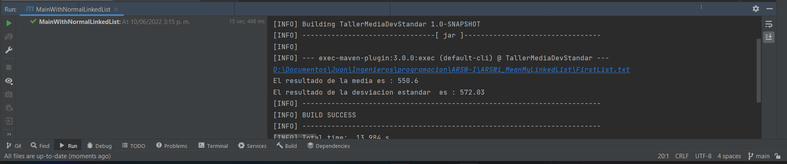
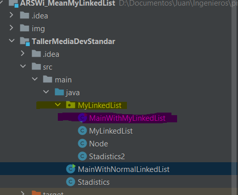
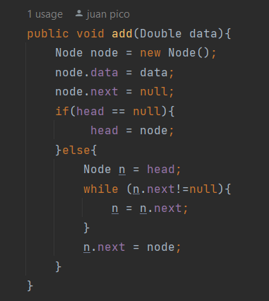
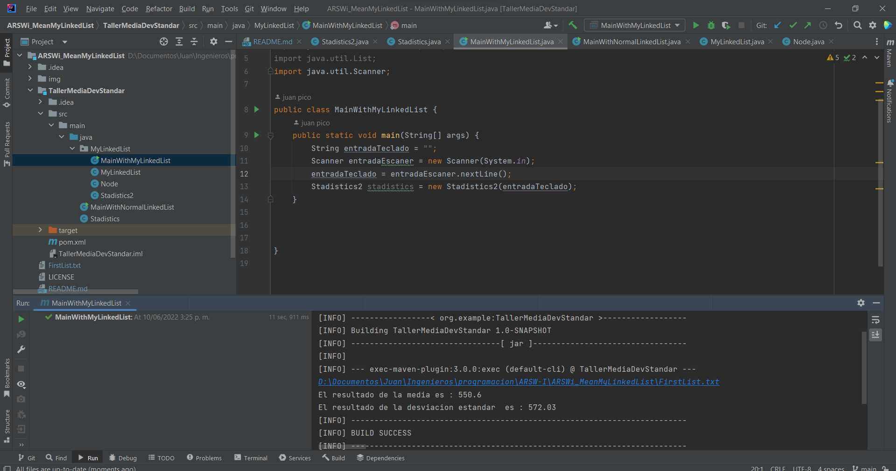

# ARSWi_MeanMyLinkedList
## Author
**Juan Andrés Pico**
## Fecha
**10/06/22**
## Introducción
En ente laboratorio se busca hacer un código que busque la media y la desviacion estandar segun un archivo txt, teniendo como entrada solo la ubicacion del directorio 

## Description of class diagram
En el directorio `src.main.java`, se encuentra la clase principal llamada `MainWithNormalLinkedList` con el método main este método llamada a la clase stadistics
la cual tiene los principales metodos llamados `mean` y `devStand` los cuales generan la media y desviación estándar con la ayuda de la clase Linked List.

## Description of class diagram 2.0
Por otro lado se creo una propia `LinkedList` que está ubicado en el directorio `src.main.java.MyLinkedList`

Donde hay una clase con el metodo main llamada `MainWithMyLinkedList` , que hace llamado a la clase `Stadistics2` que usa nuestra linkedList
que es ayudada por una clase `Node` para poder guardar los datos y además saber su posición con los métodos `get()` y `size` y así sacar la media
y deviación estandar.

Por ultimo la muestra de que funciona con la linkedlist creada.

## Aclaración 
Tanto la LinkedList de java tanto la creada tienen su propio main.

## LOC/h.
+ Entendimiento del problema: **1 Hora**
+ Diseño del problema: **10 minutos**
+ Programación: **5 Horas - 6 horas**
+ Escritura del informe: **30 minutos** 
